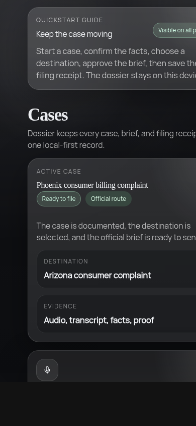
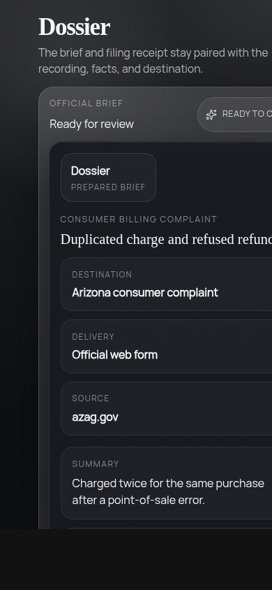

# codex-dossier



Dossier is a local-first incident capture and reporting app.

Product line:

`Document the case. Prepare the brief. Preserve the filing trail.`

## What It Does

- Records an incident on-device
- Preserves the original recording with a hash and custody log
- Builds a transcript and structured case details
- Recommends reporting destinations with trust/source labels
- Drafts the report, tracks send actions, saves proof, and exports a case packet

## Current Release Assets

- Android prerelease:
  - `https://github.com/greyok00/codex-dossier/releases/tag/v0.1.0-android-debug`
- Android asset:
  - `app-debug.apk`
- iOS/macOS-side artifact available from this machine:
  - an `xtool` shell source bundle for `ios-xtool-shell/`
  - this is not a compiled `.ipa` or `.app`

## Quick Walkthrough

1. Open `Start a case` and save the incident recording.
2. Review the transcript and confirm the case details.
3. Open `Destinations` and choose the right reporting route.
4. Review and approve the official brief.
5. Send the brief, save the filing receipt, and export the dossier.



## Current Stack

- Frontend: React + TypeScript + Vite + PWA + Dexie
- Local AI: Transformers.js + ONNX Runtime Web
- Backend: Node.js + TypeScript + Fastify + PostgreSQL
- UI: glass component layer with a detached frontend/backend runtime shell

## Runtime Model

The frontend is intentionally detached from the backend process.

- Local case data stays usable even if the backend restarts.
- The frontend shows backend health in-app.
- Shared runtime config lives at the repo root and is consumed by both services.

More detail:

- [docs/DETACHED_FRONTEND_BACKEND_ARCHITECTURE.md](docs/DETACHED_FRONTEND_BACKEND_ARCHITECTURE.md)
- [docs/FRONTEND_UI_REBUILD_FEATURE_LIST.md](docs/FRONTEND_UI_REBUILD_FEATURE_LIST.md)
- [docs/CAPACITOR_MOBILE_SHELL.md](docs/CAPACITOR_MOBILE_SHELL.md)
- [docs/ANDROID_LOCAL_APK_BUILD.md](docs/ANDROID_LOCAL_APK_BUILD.md)
- [docs/XTOOL_IOS_SHELL.md](docs/XTOOL_IOS_SHELL.md)

## Run It

Backend:

```bash
npm install
npm run backend:dev
```

Frontend:

```bash
cd frontend
npm install
npm run dev
```

Android local APK path:

```bash
cd frontend
npm run android:build:debug
```

iOS xtool shell path:

```bash
cd frontend
npm run build:ios:shell
cd ..
./scripts/xtool-status.sh
```

Default dev URLs:

- Frontend: `http://127.0.0.1:5173`
- Backend health: `http://127.0.0.1:3100/v1/health`

## Checks

Frontend:

```bash
npm --prefix frontend run check
npm --prefix frontend run test -- --run
npm --prefix frontend run build
```

Current verification status:

- Frontend typecheck: pass
- Frontend tests: pass
- Frontend production build: pass

Backend:

```bash
npm run backend:check
npm run backend:build
```

Postgres integration tests:

```bash
npm run db:test:up
npm run test:integration:pg
npm run db:test:down
```

## Repository Layout

- `frontend/` React client, local AI flow, UI, local storage
- `src/` backend runtime and API routes
- `test/` backend integration tests
- `docs/` product, schema, API, and architecture docs
- `tools/` import and utility tooling
- `generated/` generated registry/import artifacts

## Documentation

- [docs/TECH_SPEC.md](docs/TECH_SPEC.md)
- [docs/OPENAPI.json](docs/OPENAPI.json)
- [docs/SCHEMA.sql](docs/SCHEMA.sql)
- [docs/FRONTEND_TYPE_MAP.md](docs/FRONTEND_TYPE_MAP.md)
- [docs/BACKEND_IMPLEMENTATION_PLAN.md](docs/BACKEND_IMPLEMENTATION_PLAN.md)
- [docs/ROUTING_REGISTRY_MIGRATION_AND_SEED_PLAN.md](docs/ROUTING_REGISTRY_MIGRATION_AND_SEED_PLAN.md)
- [docs/PROJECT_STATUS.md](docs/PROJECT_STATUS.md)

## Current Constraints

- Large local AI assets are still the biggest frontend payload.
- This repository now includes Capacitor Android and iOS project shells under `frontend/android` and `frontend/ios`.
- Those folders are native wrapper projects, not proof that final `.apk` or `.ipa` binaries were built on this machine.
- Android packaging is working locally and a debug APK has been uploaded to GitHub Releases.
- The `xtool` iOS shell is scaffolded and bundled, but final iOS packaging still requires Apple SDK input (`Xcode.xip` or `Xcode.app`) and xtool authentication.
- The web app is the active development and validation shell.
